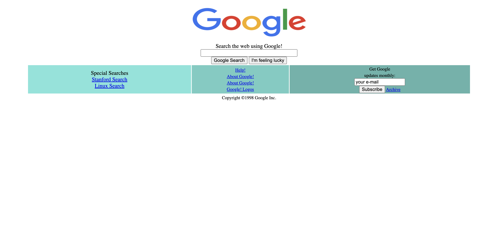
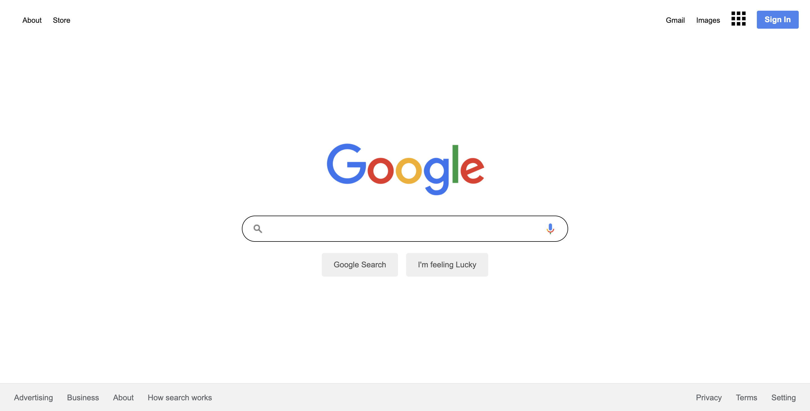

## Google Ana Sayfasını Tasarlamak - Odev2
   Hepimiz her gün Google kullanıyoruz ve çok işimize yarıyor değil mi? Her gün Google'da milyonlarca arama yapılıyor ve hatta siz de bu sayfaya 
gelmek için Google'ı kullanmış olabilirsiniz.Peki Google'ın geçmişten günümüze nasıl geliştiğini hiç merak ettiniz mi?
   Google 1996 yılında kuruldu ve ilk versiyonunu 1998 yılında yayınladı. 1998, çok uzun bir süre önce değil mi? İlk versiyonu ile şu anki versiyonu arasında büyük fark var
tabii ki. Peki size Google'ın ilk versiyonunu gösterebileceğimizi söylesek ne hissederdiniz?
   İnternetteki gelmiş geçmiş bütün web sitelerini görebileceğiniz Wayback Machine adında bir web arşivi bulunmakta. Google 1998 linkinden Google'ın ilk versiyonu nasılmış
görebilirsiniz. Oldukça garip öyle değil mi? Garip olmasının yanında bu sizin HTML bölümündeki üçüncü ve son ödeviniz olacak. Bu sayfayı tasarlamanızı istiyoruz.

## Google Şuanki Ana Sayfasını Tasarlamak - Odev3
Bir zamanlar basit ama gururlu bir Google Ana Sayfası vardı, hatırladınız mı? Yıllaar yıllar geçti ve o ana sayfa gelişti, serpildi ve bugünkü halini aldı. HTML'in son ödevinde Google'ın ilk tasarımı üzerinde çalışmıştık ve CSS bölümünde günümüzdeki halini tasarlayacağımızı söylemiştik. Evet, o gün bugündür arkadaşlar. Bu ödevde Google'ın bugünkü ana sayfasını tasarlayacağız.

